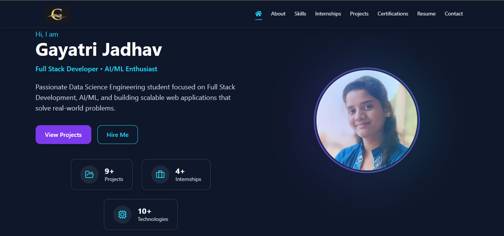

# 💼 Personal Portfolio Website

A modern and responsive personal portfolio website built using React, Vite, and Tailwind CSS to showcase my projects, internships, certifications, technical skills, and professional journey.

The portfolio highlights my work in Full Stack Web Development, Data Analysis, Machine Learning, and Artificial Intelligence (AI), featuring project showcases, resume download, certifications, and contact information in an interactive and user-friendly interface.

# 🚀 Live Demo
🔗 View Portfolio Live

https://gayatri-jadhav.netlify.app/

🛠️ Tech Stack

⚛️ React (Vite)

🎨 Tailwind CSS

📦 JavaScript (ES6+)

💻 Responsive Design

✨ Custom UI & Animations

## 📂 Features

🏠 Hero Section with stats (Projects, Internships, Certifications)

👩‍💻 About Me Section

✨ Technical Skills showcase

🎓 Education Details

💼 Internship Experience

📜 Certifications 

📬 Contact Section

🎈 Animated Background Effects

📱 Fully Responsive Design

👩‍💻 Developed by

Gayatri Jadhav

Aspiring Full Stack Developer | Data Analyst | AI/ML Enthusiast

